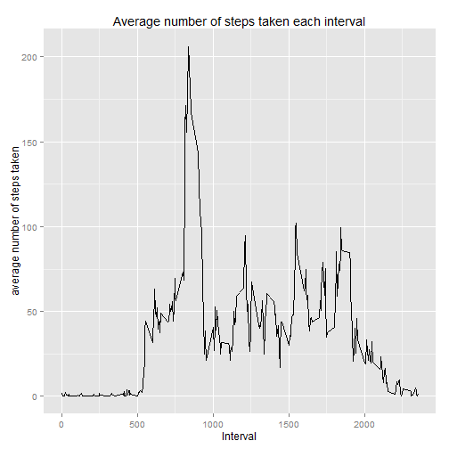
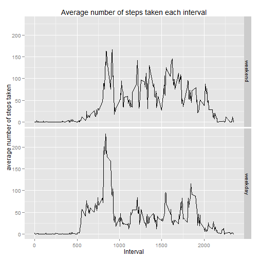

# Loading and preprocessing the data
Load needed packages:

```r
library(plyr);
library(ggplot2);
library(timeDate);
```

Load the dataset:

```r
data <- read.csv("activity/activity.csv");
```
Convert the date:

```r
data$dates <- as.Date.character(data$date);
```
Get the data without NAs in "steps":

```r
idsNA <- lapply(data$steps,is.na);
idsNotNa <- lapply(idsNA,identical,FALSE);
dataWithoutNA <- data[unlist(idsNotNa),];
```

# Q1: What is mean total number of steps taken per day?
Group data by date and calculate some statistics:

```r
groupedByDate <- ddply(dataWithoutNA, c("date"), summarise,
                meanSteps = mean(steps),
                sdSteps   = sd(steps), 
                numSteps = sum(steps));
groupedByDate$date <- as.Date.character(groupedByDate$date);
```
## Plot histogram of the total number of steps taken each day

```r
ggplot(groupedByDate, aes(date,numSteps)) +
     geom_histogram(stat="identity") +
     labs(x="Date", y="number of steps taken", title="Number of steps taken each day") +
     theme_grey();
```

 
## A1: Mean and Median of the total number of steps taken per day
The mean and median of the total number of steps taken per day are as follows:

```r
mean(groupedByDate$numSteps);
```

```
## [1] 10766.19
```

```r
median(groupedByDate$numSteps);
```

```
## [1] 10765
```

## Q2: What is the average daily activity pattern?
Group data by interval and calculate some statistics:


```r
groupedByInterval <- ddply(dataWithoutNA, c("interval"), summarise,
                meanSteps = mean(steps),
                sdSteps   = sd(steps), 
                numSteps = sum(steps));
```
Plot time series:


```r
ggplot(groupedByInterval, aes(interval,meanSteps)) +
     geom_line() +
     labs(x="Interval", y="average number of steps taken", title="Average number of steps taken each interval")+
     theme_grey( );
```

 


The interval with the maximum averaged number of steps is the following one:


```r
groupedByInterval[which.max(groupedByInterval$meanSteps),1];
```

```
## [1] 835
```


# Imputing missing values
Number of missing values in the dataset:

```r
sum(unlist(lapply(data$steps,is.na)))
```

```
## [1] 2304
```
## Imputate missing values by the rounded mean for the interval
Get indices of row with NAs and create new variable to store new cleaned dataset

```r
indexesNAs <- which(idsNA == TRUE);
dataWithImputation <- data;
```
Iterate over all rows with NAs and recplace steps whith rounded mean of steps taken on average for that interval

```r
for(i in 1:length(indexesNAs)){
    actIndex <- indexesNAs[i];
    dataWithImputation[actIndex,1] = 
        round(groupedByInterval[groupedByInterval[,1] == 
        dataWithImputation[actIndex,3],2]);
}
```

## Plot histogram of the total number of steps taken each day for the dataset with imputed missing values

```r
groupedByDateWithImputation <- ddply(dataWithImputation, c("date"), summarise,
                meanSteps = mean(steps),
                sdSteps   = sd(steps), 
                numSteps = sum(steps));
groupedByDateWithImputation$date <- as.Date.character(groupedByDateWithImputation$date);
ggplot(groupedByDate, aes(date,numSteps)) +
     geom_histogram(stat="identity") +
     labs(x="Date", y="number of steps taken", title="Number of steps taken each day") +
     theme_grey();
```

 

## Calculate and report mean and median of the total number of steps taken per day

```r
mean(groupedByDateWithImputation$numSteps);
```

```
## [1] 10765.64
```

```r
median(groupedByDateWithImputation$numSteps);
```

```
## [1] 10762
```
The values does not differ extremely from those of the first part. If we imputate the missing values on the estimates of the total daily number of steps, we would mix the number of steps for each interval which are extremely different from each other depending on the specific interval. This would lead to a "bad" imputation.


# Q3: Are there differences in activity patterns between weekdays and weekends?
Get the day of the week for each date and create factor variable which stores if day of week belongs to the weekend or a weekday (using german names!).

```r
dayOfWeek <- weekdays(dataWithImputation$dates);
isWeekend <- dayOfWeek %in% c("Samstag","Sonntag");
weekendWeekday <- factor (isWeekend, levels = c(TRUE,FALSE), labels=c("weekend","weekday"));
dataWithImputation$weekendWeekday <- weekendWeekday;
```
Group data by interval and day of week (weekend of weekday) and plot data.

```r
groupedByIntervalWithImputation <- ddply(dataWithImputation, c("interval","weekendWeekday"), summarise,
                meanSteps = mean(steps),
                sdSteps   = sd(steps), 
                numSteps = sum(steps));
ggplot(groupedByIntervalWithImputation, aes(interval,meanSteps)) +
     geom_line() +
     labs(x="Interval", y="average number of steps taken", title="Average number of steps taken each interval") +
      facet_grid(weekendWeekday ~ .) +
      theme_grey();
```

 
A3: As we can conclude from the above plot, their are some differences in the activity pattern between weekdays and weekends.


